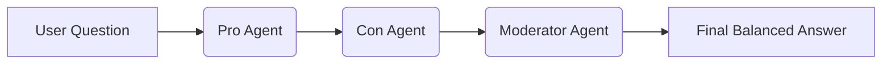

# 🧠 Dual-Agent Debate Pattern (LangGraph + Groq)

This project implements a **Dual-Agent Debate Architecture** using **LangGraph** and **Groq LLMs**, where two AI agents (Pro and Con) debate a given question and a Moderator synthesizes a balanced final answer.

This pattern is useful for:

* Critical reasoning systems
* Decision support tools
* Ethical AI analysis
* Multi-perspective generation
* Advanced RAG/Agentic reasoning pipelines

---

## ✨ Key Idea

Instead of generating a single response, the system:

1. Creates a **Pro Agent** to support a position
2. Creates a **Con Agent** to challenge it
3. Uses a **Moderator Agent** to generate a final, balanced answer

This mimics **structured human debate**, improving reasoning depth and output quality.

---

## 🏗️ Architecture



---

## 🔧 Tech Stack

* **LangGraph** – for agent orchestration and state handling
* **LangChain** – for prompt templates
* **Groq LLM** – `llama-3.3-70b-versatile`
* **Python** – core language
* **dotenv** – environment variable handling

---

## ✅ Sample Input

```python
inputs = {"question": "Is AI safe for humanity?"}
```

## ✅ Sample Output (Excerpt)

> “The question of whether AI is safe for humanity is complex…
> A balanced approach would involve acknowledging benefits while implementing strong safeguards…”

The final answer is **more nuanced and reliable** than a single-agent response.

---

## 🌟 Why this matters

Traditional LLM pipelines = one answer
This system = **multiple perspectives + critical thinking**

---


